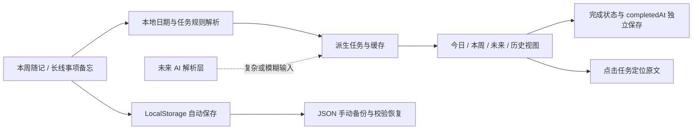

# DDL Assistant：产品决策、关键转折与技术架构

本文记录 DDL Assistant V1.0 在产品定位、范围控制和实现方式上的关键选择。重点说明每项决定解决了什么问题、接受了哪些代价，以及未来在什么条件下重新评估。

## 1. 产品与架构的核心判断

DDL Assistant 的当前定位是：

> 面向办公室知识工作者的工作便签本 + DDL 管理器。

产品承载的主要行为是连续记录。系统在保留原始上下文的基础上，提取日期、时间、项目归属和待跟进事项，再生成今日、本周、未来和历史视图。

当前设计遵循五项原则：

1. 优先记录，其次整理，最后才是任务；
2. 原始文本保存事实和上下文，任务列表承担提醒与处理；
3. 时间是主要推进维度，项目信息用于消除任务歧义；
4. V1 优先保证本地、稳定、可恢复和低使用门槛；
5. AI 在后续阶段补充复杂输入与内容生成能力。

## 2. 关键产品转折

### 2.1 从 DDL 提示器转向工作便签本

早期需求更接近 Todo List 或 DDL 提醒器，关注如何创建和管理任务。实际使用表明，工作信息通常先以沟通记录、会议和临时安排的形式出现。用户首先需要保存完整内容，随后才会从中识别行动项。

产品因此调整为“连续便签 + DDL 派生视图”：

- 左侧保留完整原文；
- 右侧自动提取时间节点；
- 用户无需逐条创建任务；
- 原文中的计划、背景和修改过程可以继续保留。

这次调整重新定义了产品的主体，也成为后续范围取舍的依据。

### 2.2 从普通网页转向 PWA

网页原型已经具备基础功能，但每次使用仍要先打开浏览器并找到对应页面，再从其他工具中寻找记录入口，无法形成一个点击即用的独立入口。

改为 PWA 后，产品拥有独立入口和窗口，可以固定到桌面或任务栏。点击入口后直接进入工作区，产品开始进入每天的真实工作流。

这次转折说明：启动路径和入口距离会直接影响工具能否被持续使用。

### 2.3 确立原文与任务状态的单向关系

曾考虑在右侧勾选任务后，自动划掉左侧对应文字。该方案会引入双向同步：原文修改、日期调整、取消完成和重新解析都可能造成状态错位。

最终采用：

- 原文生成任务；
- 完成状态和完成时间独立保存；
- 勾选任务不自动改写原文；
- 点击右侧任务可以定位到对应原文，再由用户修改。

这种设计保留了任务到原文的可追溯性，同时控制同步复杂度。

### 2.4 每周滚动工作区与跨周任务并存

产品沿用原有的便签习惯：每周一开启新的随记，上周内容自动归档，当前工作区保持干净。

原文归档不会结束任务生命周期。未完成任务仍按日期和状态保留在右侧视图中，跨周后继续提醒。

周归档负责整理记录，任务视图负责持续追踪，两者使用不同的生命周期。

### 2.5 数据丢失经历推动备份与恢复

早期迭代中曾出现页面更新异常，本地记录未备份，只能重新整理原始内容。

V1 随后增加手动 JSON 导出与恢复，并在导入时校验文件结构。写入过程失败时，系统恢复已经改动的键值，避免留下部分导入结果。

备份功能当前属于低频的恢复和迁移通道，适用于删除重装、更换浏览器、迁移设备或本地数据异常。

### 2.6 从规则解析走向混合 AI 架构

V1 使用本地规则处理明确日期、时间、项目上下文、`>` 待跟进和 `//` 备注。

下一阶段计划保留已经验证的规则能力，让 AI 处理模糊时间、非标准表达和复杂长文本。总结草稿、跟进说明等内容生成能力建立在可靠任务数据之上，分阶段推进。

## 3. 关键决策记录

### 决策一：V1 不增加优先级、标签和任意多层嵌套

**原因**

产品希望降低记录前的判断和填写动作。优先级、标签和复杂层级会要求用户维护更多字段，也会逐渐改变连续便签的使用方式。

当前项目与日期的两层上下文继承已经覆盖主要场景：

```text
项目A：
6.24：
完成方案初稿
确认会议材料
```

更深层级需要依赖缩进或额外符号表达结构。该类场景出现较少，目前接受每行重复日期等少量输入冗余。

**代价**

- 无法进行复杂筛选和统计；
- 任务量很大时，日期视图可能变得拥挤；
- 不适合表达复杂工作分解结构。

**重新评估条件**

- 多位真实用户反复提出相同需求；
- 单纯按日期已经无法有效查看任务；
- AI 可以自动判断层级和分类，用户无需额外维护格式。

### 决策二：以时间视图推进，项目上下文只用于识别归属

**原因**

事项通常按日期推进。多个项目可能出现同名交付物，例如“方案初稿”或“反馈意见”，因此系统支持：

```text
项目A：
6.24 完成方案初稿
6.26 确认会议材料
```

后续任务继承项目上下文，并在右侧显示 `[项目A]` 前缀。日期继续承担排序和提醒作用。

**代价**

- 没有独立项目主页、看板和项目级统计；
- 不适合查看完整项目流转状态。

**重新评估条件**

用户开始频繁提出项目级进度查看需求，或产品定位扩展到团队协作。

### 决策三：原文作为事实来源，任务状态独立保存

**原因**

原文包含计划、背景、备注和使用判断。任务列表由原文派生，完成状态属于用户对任务的处理结果。

两类数据分开后：

- 原文可以持续编辑；
- 日期和标题变化后重新解析；
- 完成时间可以独立用于历史记录和未来周报；
- 右侧任务可以定位到原文；
- 系统无需自动修改两套内容。

**代价**

- 大幅修改任务文本或日期时，派生任务身份可能变化，原附加状态可能重置；
- 更早历史周目前缺少完整的查看和编辑入口；
- 用户需要理解原文修改会触发任务重新生成。

**重新评估条件**

任务需要承载负责人、阶段历史、多次跟进记录等长期状态时，再考虑独立任务实体和更稳定的任务标识。

### 决策四：采用 PWA、LocalStorage 和手动备份

**原因**

V1 首先服务本地桌面工作流。PWA 提供独立入口、任务栏固定、离线打开和较低的开发维护成本。LocalStorage 可以在无账号、无后端的情况下保存原文、解析结果和任务状态。

**代价**

- 无法自动跨设备同步；
- 清理浏览器数据或设备故障可能造成数据丢失；
- 提醒依赖应用运行状态；
- 数据增加后，启动阶段的读取、重新解析和渲染可能变慢；
- 手动备份依赖用户主动操作。

**重新评估条件**

跨设备需求成为持续使用的主要阻力，或 AI 接入需要安全的服务端能力时，再评估账号、数据库和同步方案。

### 决策五：提醒以视图为主，到点通知为补充

**原因**

用户每天会打开 PWA，今日、本周和未来视图承担主要提醒作用。具体时间任务在应用运行期间触发系统通知或页面内提示。

**代价**

- 应用关闭、浏览器限制后台运行或电脑休眠时，通知无法保证触发；
- 当前能力不适合作为强提醒或闹钟系统。

**重新评估条件**

用户明确需要关闭应用后的可靠提醒，并愿意接受后端推送或客户端能力带来的成本和权限要求。

### 决策六：V2 采用规则优先、AI 补充的混合方式

**原因**

现有规则对常见明确输入已经稳定，具备响应快、结果可预测、离线可用和低调用成本等优势。AI 更适合处理模糊表达、复杂长文本和面向外部用户的自由输入。

规划中的处理顺序为：

1. 明确格式由本地规则直接处理；
2. 规则无法可靠判断的内容交给 AI；
3. 低置信度结果提示用户确认；
4. 原始文本始终保留并可修改。

**代价**

- 需要维护规则与 AI 两条解析路径；
- 需要处理安全、成本、延迟和结果一致性；
- 同一输入可能涉及规则与模型结果的合并。

**重新评估条件**

真实用户数据证明大部分输入都需要 AI，且模型准确率、成本和安全方案达到稳定水平时，再评估让 AI 承担主要解析任务。

## 4. 当前技术架构



### 4.1 输入与保存

- 本周随记和长线事项备忘分别保存；
- 输入后立即写入 LocalStorage；
- 解析在短暂延迟后执行，减少连续输入时的重复计算；
- 每周使用独立的存储键，上周内容可从抽屉中查看和修改。

### 4.2 解析与派生

解析器逐行处理原文，支持：

- 明确日期、相对日期和具体时间；
- 日期域继承；
- 项目上下文继承；
- `>` 待跟进事项；
- `//` 整行排除或行内备注截断。

任务 ID 根据来源、项目上下文、原始行和日期生成哈希，用于关联完成状态。原始行或日期发生明显变化时，任务可能获得新的 ID。

### 4.3 状态与历史

- 任务完成状态保存在独立的状态对象中；
- 勾选时记录 `completedAt`；
- 当天完成的任务保留在今日列表底部；
- 早于今天完成的任务进入历史，并按本周、上周和更早周次分组；
- 周随记归档不会删除未完成任务。

### 4.4 备份与恢复

导出功能保存以 `workspace_` 开头的本地数据。导入前检查允许的键名和主要数据类型；写入中途失败时回滚已经写入的内容。

这套机制降低了无效备份覆盖现有数据的风险，也为纯本地架构提供恢复通道。

### 4.5 PWA 与提醒

Service Worker 用于 PWA 离线缓存和系统通知展示。页面每隔一段时间检查到点任务，优先显示系统通知，通知不可用时使用页面内提示。

该方案没有后端推送能力，应用关闭后的提醒不属于 V1 保证范围。

### 4.6 当前已知技术问题

- 打开应用后，页面框架先出现，原文和任务数据会稍后集中显示；
- 运行后的输入、修改和勾选整体顺畅；
- 启动过程会读取本地记录、重建解析缓存并渲染任务，仍需通过性能分析确认主要耗时；
- 周切换初始化完成前快速输入，曾出现新内容被归入上周的问题；
- 当前提供上周随记修改入口，更早历史周的检索和编辑方式仍待设计。

## 5. AI 协作方式与责任边界

项目采用 ChatGPT 与 Codex 参与需求讨论和代码实现，典型流程为：

1. 在实际使用中发现具体问题；
2. 将问题、使用场景和已有想法交给 AI；
3. 比较方案的价值、复杂度和副作用；
4. 确认范围后由 Codex 实现；
5. 使用脱敏样本进行验收；
6. 出现副作用后继续修复、缩小范围或暂缓功能。

AI 主要承担：

- 提供候选方案和风险提醒；
- 协助拆解实现路径；
- 生成和修改代码；
- 补充边界测试思路；
- 模拟难以直接复现的日期和存储异常。

项目维护者承担：

- 定义实际问题；
- 判断功能是否符合产品定位；
- 比较收益、成本和风险；
- 确认最终方案和范围；
- 使用脱敏数据验收；
- 决定版本是否发布。

日常迭代采用小步修改，重点测试本次新增能力。V1.0 发布前建立完整的 `TESTING.md`，逐项执行输入保存、日期解析、上下文继承、状态历史、待跟进、提醒、备份恢复、PWA、跨周和异常场景测试。

## 6. 当前架构边界

V1.0 当前支持本地和桌面为主的工作流。以下能力留在后续阶段评估：

- 账号和跨设备同步；
- 多人协作、权限与审批；
- 项目看板和复杂任务依赖；
- 关闭应用后的可靠推送；
- 完整历史周检索；
- 自动生成周报和沟通草稿；
- AI 自然语言解析。

下一阶段的重点是先解决启动性能和使用门槛，再通过使用反馈决定 AI、云端和协作能力的投入顺序。
